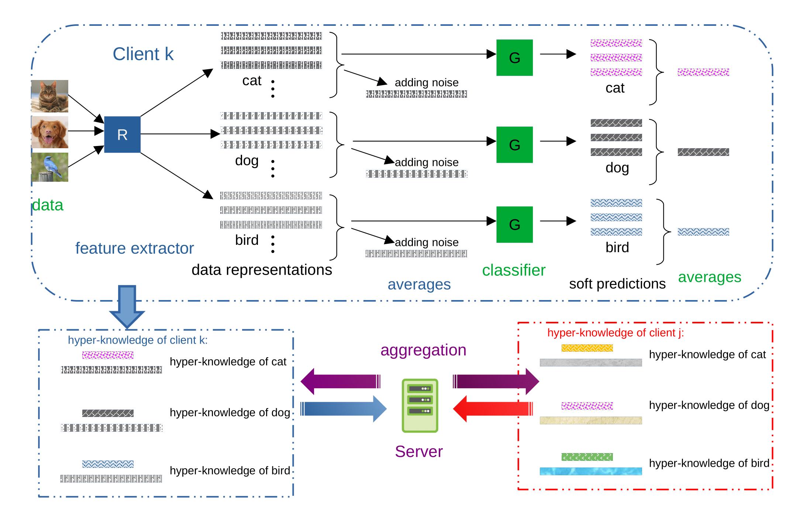

# Federated Hyper Knowledge Distillation
This is an official repository for our ICLR2023 paper
* "[The Best of Both Worlds Accurate Global and Personalized Models through Federated Learning with Data-Free Hyper-Knowledge Distillation](https://arxiv.org/abs/2301.08968)"
<figure>
  <p align="center">
  
  </p>
  <figcaption width=80%><em>
  A flow diagram showing computation, encryption and aggregation of hyper-knowledge.
  </em></figcaption>
</figure>
<br/>
<br/>

### Environment 
This project is developed based on python 3.6 with [torch1.9 (rocm4.2)](https://pytorch.org/get-started/previous-versions/). We use [conda](https://www.anaconda.com/docs/main) to manage the virtual environment.
```
git clone git@github.com:CityChan/Federated-Hyper-Knowledge-Distillation.git
cd Federated-Hyper-Knowledge-Distillation
conda create -n fedhkd --python=3.6
conda activate fedhkd
pip install torch==1.9.1+rocm4.2 torchvision==0.10.1+rocm4.2 torchaudio==0.9.1 -f https://download.pytorch.org/whl/torch_stable.html
pip install -r requirements.txt
```

### Code structure 
* `main.py`: general set up for training and evaluate FL schemes
* `models.py`: model architectures for running experiments
* `sampling.py`: functions for generating non-iid datasets for federated learning
* `utils.py`:  functions for computing accuracy, knowledge distillation and model aggregation
* `mem_utils.py`: library for monitoring memory usage and training time
* `option.py`: define hyper-parameters
* `Server/*.py`: object definition for server in differents scheme
* `Client/*.py`: object definition for client in differents schemes

### Parameters
* --dataset: 'CIFAR10', 'CIFAR100', ' SVHN'
* --batch_size: batchsize, 64 by default 
* --num_epochs: number of global rounds, 50 by default
* --lr: learning rate, 0.001 by defalut
* --lr_sh_rate: period of learning rate decay, 10 by default
* --dropout_rate: drop out rate for each layer, 0.2 by default
* --clip_grad: maximum norm for gradient, 1.0 by default
* --num_users: number of clients, 10 by default
* --sampling_rate: proportion of clients send updates per round, 1.0 by default
* --local_ep: number of local epochs, 5 by default
* --beta: concentration parameter for Dirichlet distribution: 0.5 by default
* --seed: random seed(for better reproducting experiments): 0 by default
* --std: standard deviation by differential private noise, 2.0 by default
* --code_len: dimention of latent vector, 32 by default
* --alg: 'FedAvg, FedProx, Moon, FedMD, Fedproto, FedHKD'
* --eval_only: only ouput the testing accuracy
* --part: percentage of each local data
* --temp: temperture for soft prediction
* --lam: weights for loss2
* --gamma: weights for loss3
* --model: 'CNN', 'resnet18', 'shufflenet'
* --save_model: save checkpoints of the model

### Running the code for training and evaluation
We mainly use a .sh files to execute multiple expriements in parallel. 
The exprimenets are saved in checkpoint with unique id. Also, when the dataset is downloaded for the first time it takes a while. 

### Acknowledgement
This work is funded by Toyota Motor Corporation. We thank all staffs in AI/ML Infrastructure & Data Lab. We can not finish this work without their help.

### Citeation
Please cite our paper, if you happen to use this code:
```
@inproceedings{chen2023best,
  title={The Best of Both Worlds: Accurate Global and Personalized Models through Federated Learning with Data-Free Hyper-Knowledge Distillation},  
  author={Chen, Huancheng and Vikalo, Haris and others},
  journal={arXiv preprint arXiv:2301.08968},
  year={2023}
}
```

